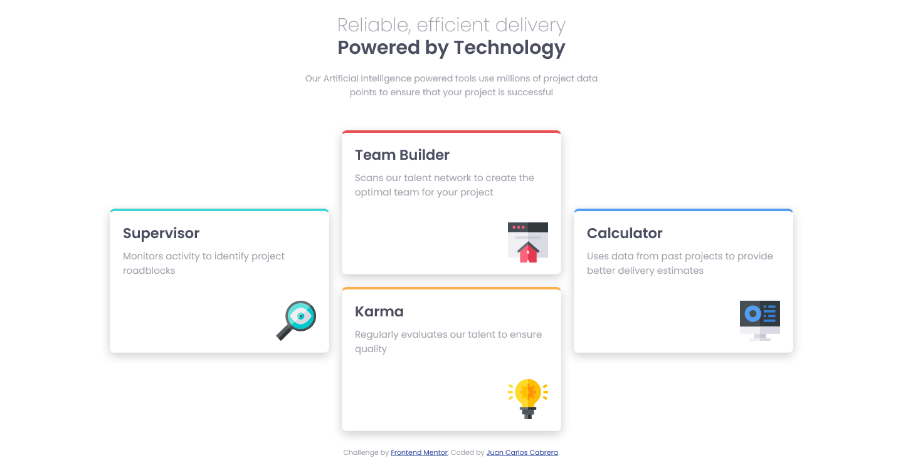

# Four card feature section solution - Frontend Mentor

Esta es la solución al desafío [Four card feature section challenge on Frontend Mentor](https://www.frontendmentor.io/challenges/four-card-feature-section-weK1eFYK).

## Tabla de Contenido

- [Introducción](#introducción)
  - [El Desafío](#el-desafio)
  - [Captura de Pantalla](#captura-de-pantalla)
  - [Links](#links)
- [Mi Proceso](#mi-proceso)
  - [Tecnologías](#tecnologías)
- [Autor](#autor)

## Introducción

### El Desafío

Realizar el layout de tarjetas lo más fiel posible al del diseño.

los Usuarios deben ver de forma óptima la página independientemente del dispositivo en que lo hagan.

### Captura de pantalla

### Links

- Solución URL: [Solución](https://www.frontendmentor.io/solutions/four-card-feature-section-IDa1HujZs6)
- Live Site URL: [Site](https://jcarloscab.github.io/four-card-feature-section-master/)

## Mi Proceso

### Tecnologías

- Flexbox
- BEM
- SASS/SCSS

## Autor

- Frontend Mentor - [@jcarloscab](https://www.frontendmentor.io/profile/jcarloscab)
- GitHub - [@jcarloscab](https://github.com/jcarloscab)
